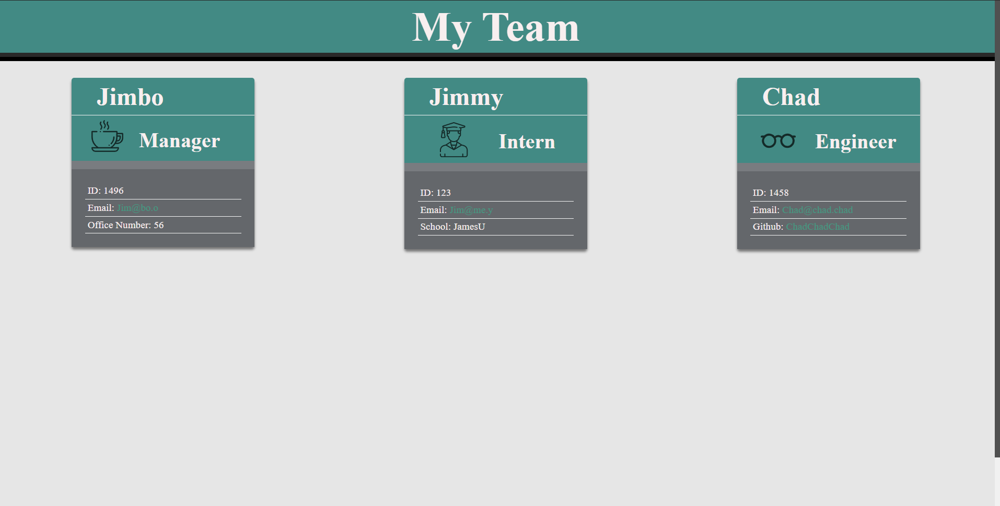

# Team Profile Generator

## Description

A team profile generator that asks a manager to input personal details, then prompts the manager/user to enter in similar details to generate new employees.
Employees can be one of two classes, either Engineers or Interns both of which require one additional specific data point after the user enters in the universal requirements for an Employee. User can create as many employees (Interns or Engineers) as they please. When finished, the application generates a new HTML file displaying each of the team members details on a card, with links to their Github or email depeding on role.

## Instructions
Open up the index.js file in a terminal of your choosing. There is a script in the package.json called "start" - for users running Node.js, simply run the command 'npm run start' to begin the application.

Your generated file will appear after all prompts have been responded to and can be found in the Output folder along with the necessary CSS files.

## Links

- [Github Repository](https://github.com/Atlas238/team-profile-generator)
- [Video Walkthrough](https://drive.google.com/file/d/1P4RQ7TgJgHOJ_GRlDfb6Ha0pzr-W6c88/view)
- [Passing Tests...](https://drive.google.com/file/d/1rncsN4nF8bN8en-jwS7SEbixA3tlXGKG/view)

## Screenshot of Sample Page

 